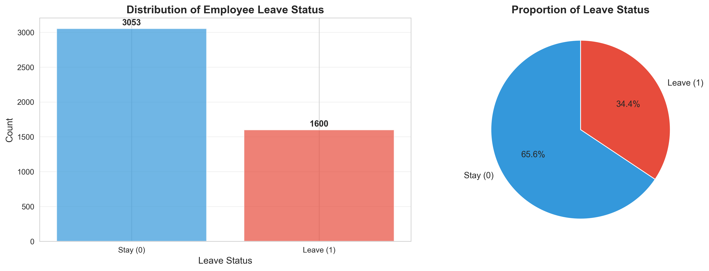
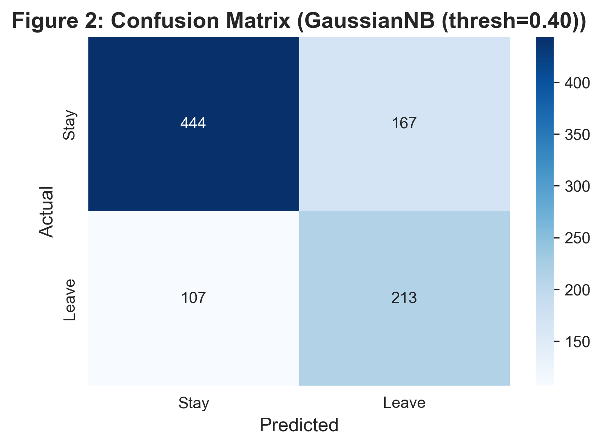
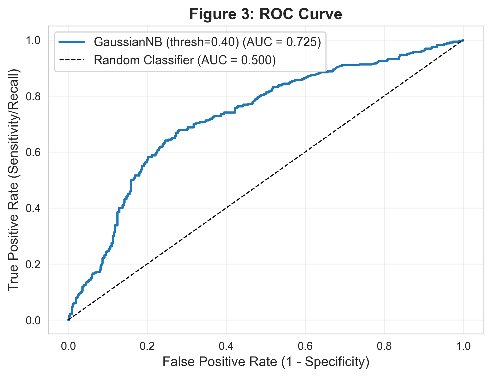
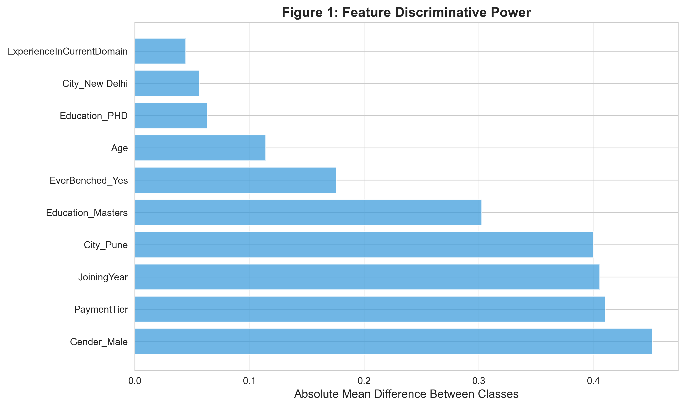
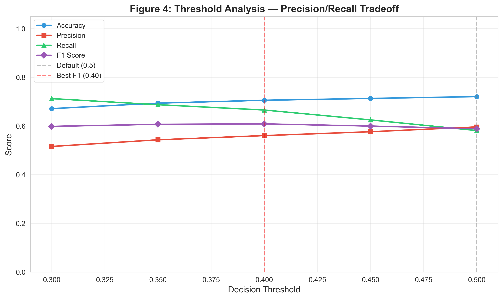
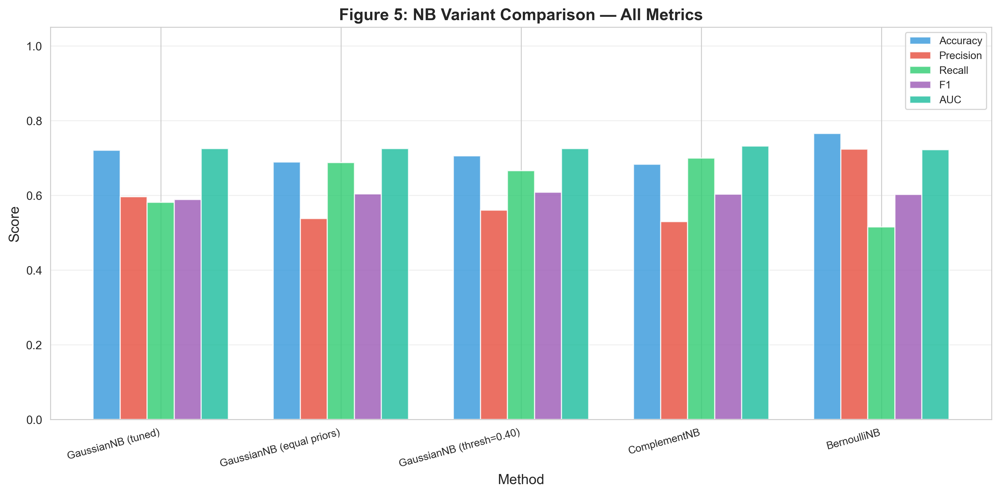

# Predicting Employee Attrition Using Naive Bayes Classification

The core problem is straightforward: employees leave, and companies rarely see it coming. The cost of a missed prediction is high — recruiting, onboarding, lost institutional knowledge. The cost of a false alarm is low — you checked in on someone who was fine. That asymmetry should drive every modeling decision.

This project uses **Naive Bayes classification** to predict which employees are likely to leave. I built a [logistic regression model](https://github.com/iNoahCodeGuy/Predicting-Employee-Attrition-Using-Logistic-Regression) on this same dataset previously, which gives me a direct baseline to compare against. The interesting question isn't just "does Naive Bayes work" — it's whether a generative model that learns feature distributions within each class makes different (and potentially better) mistakes than a discriminative model that draws a decision boundary directly.

## The Dataset at a Glance

4,653 employees. 8 features. One binary target: did they leave or not?

The first thing to notice is the class imbalance. About 34% of employees left, 66% stayed. That's a ~2:1 ratio — not extreme, but enough to cause problems if you're not paying attention.



This matters because Naive Bayes learns class priors directly from training frequencies. If 66% of your training data is "Stay," the model starts with a built-in bias toward predicting "Stay." That's fine for overall accuracy — but it kills recall on the class you actually care about.

**Dataset:** [Employee Future Prediction](https://www.kaggle.com/datasets/tejashvi14/employee-future-prediction) (Kaggle)

## Model Results

### Confusion Matrix



The confusion matrix tells the story concretely: 213 true positives (correctly flagged as leaving), 444 true negatives, 167 false positives, and 107 false negatives. Those 107 false negatives are the expensive ones — employees who left that the model missed. The 167 false positives are cheaper — just unnecessary check-ins.

### ROC Curve



AUC of 0.725. Not spectacular, but meaningfully above random (0.5). The curve shows the model has real discriminative power — it's finding signal in the data, even if it's not separating the classes perfectly.

## Key Findings

### How Naive Bayes Compares to Logistic Regression

| Metric | Naive Bayes | Logistic Regression | Difference |
|--------|-------------|---------------------|------------|
| Accuracy | 72.07% | 75.51% | -3.44% |
| Precision | 59.62% | 71.50% | -11.88% |
| Recall | 58.13% | 47.81% | **+10.32%** |
| AUC | 0.7249 | 0.7399 | -0.015 |

The headline: Naive Bayes catches 10% more of the employees who actually leave. That's the recall improvement — 58% vs 48%.

The tradeoff is precision. Logistic regression is more confident when it does flag someone (72% precision vs 60%). But in an HR context, I'd rather cast a wider net and miss fewer people. A false alarm means you had a retention conversation with someone who was fine. A missed leaver means you lost them.

The two models also make different types of errors, which is interesting. That's not a flaw — it's actually an argument for combining them in an ensemble.

### What Features Matter Most



The Bayesian likelihood analysis measures how different each feature's distribution is between the Stay and Leave classes. Larger differences mean the feature is more useful for prediction.

1. **Gender_Male** (0.4513) — the strongest signal. Male employees have notably different attrition patterns than female employees.
2. **PaymentTier** (0.4102) — compensation level is almost as predictive as gender.
3. **JoiningYear** (0.4055) — when someone joined tells you something about whether they'll stay.
4. **City_Pune** (0.3997) — Pune has ~50% attrition vs 27-32% elsewhere. Location matters.
5. **Education_Masters** (0.3025) — Master's holders leave at higher rates than Bachelor's or PhD holders.

These line up with what the exploratory analysis found, which is reassuring — two different analytical lenses pointing at the same features.

### The Precision/Recall Tradeoff



This is one of the more useful outputs. The default decision threshold is 0.5 — predict "Leave" when P(Leave) > 0.5. But there's no law that says you have to use 0.5.

Lowering the threshold to 0.4 bumps recall from 58% to 67% while precision drops from 60% to 56%. Lowering it further to 0.3 gets recall up to 71%, but precision falls to 52%. The best F1 balance lands at a threshold of 0.40 (F1 = 0.6086).

In practice, this means HR can tune the sensitivity to match their budget. Have resources for more retention conversations? Lower the threshold. Need to be more targeted? Raise it.

### Class Imbalance Experiments

I didn't just try one model and call it done. The ~2:1 class imbalance motivated testing five different approaches:



The comparison table from the analysis:

| Method | Accuracy | Precision | Recall | F1 | AUC |
|--------|----------|-----------|--------|-----|-----|
| GaussianNB (tuned) | 72.07% | 59.62% | 58.13% | 0.5886 | 0.7249 |
| GaussianNB (equal priors) | 68.96% | 53.79% | 68.75% | 0.6036 | 0.7249 |
| GaussianNB (thresh=0.40) | 70.57% | 56.05% | 66.56% | 0.6086 | 0.7249 |
| ComplementNB | 68.31% | 52.96% | 70.00% | 0.6030 | 0.7316 |
| BernoulliNB | 76.58% | 72.37% | 51.56% | 0.6022 | 0.7223 |

BernoulliNB has the highest accuracy (76.58%) and precision (72.37%), but the worst recall (51.56%). It's being conservative — fewer predictions of "Leave," but more accurate when it does predict it. ComplementNB goes the other direction — highest recall (70%) but lowest precision (53%).

I selected the threshold-tuned GaussianNB (thresh=0.40) as the best model by F1 score. It hits the best balance: 66.56% recall, 56.05% precision, 0.6086 F1. The key takeaway from this whole exercise: always test instead of assume. The imbalance does matter, and different approaches handle it in meaningfully different ways.

## Methodology

### 1. Exploratory Analysis

The dataset has 4,653 employees with 8 features and a binary target (LeaveOrNot). No missing values, which is rare and nice.

The main thing I needed to check before choosing Naive Bayes was whether the continuous features — Age, JoiningYear, ExperienceInCurrentDomain — are roughly normally distributed. GaussianNB assumes they are. Age checked out reasonably well. JoiningYear and Experience are more discrete and skewed, which means the normality assumption is only partially satisfied. Not a dealbreaker, but worth knowing going in.

The class imbalance (34.4% Leave vs 65.6% Stay) was the most consequential finding from EDA. It's what motivated the entire class imbalance experiment section later. A prior exploratory analysis on this dataset had already identified strong predictors — gender (47% female attrition vs 26% male), city (Pune at ~50%), payment tier (Tier 2 at ~60%), and education (Masters holders). So I focused the EDA here on distributional properties rather than repeating that earlier work.

### 2. Preprocessing

Four of the eight features are categorical (Education, City, Gender, EverBenched). Naive Bayes needs numerical inputs to compute probability distributions. The question is how to convert categories into numbers without imposing false ordinal relationships — "Bangalore" isn't greater than "Pune."

One-hot encoding solves this. Each categorical value becomes its own binary column. I used `drop_first=True` to avoid redundancy (if you know it's not Bangalore and not Pune, it must be New Delhi). This took the original 8 columns to 10 features: 4 numerical + 6 binary indicators.

I also applied StandardScaler, fit on training data only to prevent information leakage. GaussianNB is technically scale-invariant, but scaling improves numerical stability and keeps the door open for comparing with variants that aren't. The stratified 80/20 split preserved the 34.4% leave rate in both partitions — 3,722 training samples, 931 test samples.

### 3. Model Development

I started with baseline GaussianNB — no tuning, default everything. Test accuracy: 71.97%.

Then I ran GridSearchCV over `var_smoothing` values from 1e-9 to 0.001. Best value: 0.001. Test accuracy: 72.07%. That's a 0.11% improvement. Basically nothing. This told me something important: the model's weakness isn't smoothing — it's something structural.

So I went after the class imbalance. Five experiments:
- **Equal priors [0.5, 0.5]**: forces the model to treat both classes equally instead of learning the 66/34 split. Recall jumped from 58% to 69%, but precision dropped. The model got more aggressive about predicting "Leave."
- **Threshold tuning**: tested decision thresholds from 0.3 to 0.5. Best F1 at threshold 0.40 — recall of 66.56% with precision at 56.05%.
- **ComplementNB**: designed for imbalanced datasets, originally built for text classification. Got the highest recall (70%) but lowest precision (53%). Not ideal for this mixed-type data, but worth testing.
- **BernoulliNB**: designed for pure binary features. Highest accuracy (76.58%) but lowest recall (51.56%). Too conservative for a retention-focused use case.

The threshold-tuned GaussianNB won by F1 score. The whole exercise reinforced something I believe strongly: test your assumptions. Don't just pick a model and assume the defaults are fine.

### 4. Evaluation

No single metric tells the full story, especially with imbalanced classes. A model that predicts "Stay" for everyone gets 65.6% accuracy while catching zero at-risk employees. Useless.

The metrics I focused on:
- **Recall (66.56%)**: the model catches two-thirds of employees who actually leave. This is what drives the value of early intervention.
- **Precision (56.05%)**: when it flags someone, it's right about 56% of the time. Not great in isolation, but acceptable if the cost of a check-in is low.
- **Specificity (72.67%)**: correctly clears 73% of employees who stay. Reasonable — not too many false alarms.
- **F1 (0.6086)**: balances precision and recall into one number. Best among all five variants tested.
- **AUC (0.7249)**: moderate discriminative power across all thresholds.

The ROC curve and confusion matrix tell the story visually. The threshold analysis shows exactly how HR could tune the sensitivity to match their resources.

## Project Structure

```
├── employee_attrition_naive_bayes.ipynb   # Main analysis notebook
├── employee_attrition_naive_bayes.py      # Standalone Python script
├── employee_attrition_naive_bayes.html    # HTML export
├── Employee.csv                           # Dataset (4,653 employees)
├── requirements.txt                       # Python dependencies
├── figures/                               # Generated visualizations
│   ├── confusion_matrix.png
│   ├── roc_curve.png
│   ├── feature_importance.png
│   ├── class_distribution.png
│   ├── feature_distributions.png
│   ├── probability_distribution.png
│   ├── threshold_analysis.png
│   └── imbalance_comparison.png
└── README.md
```

## Quick Start

### Prerequisites

- Python 3.8+
- pip

### Installation

```bash
git clone https://github.com/iNoahCodeGuy/Predicting-Employee-Attrition-Using-Naive-Bayes.git
cd Predicting-Employee-Attrition-Using-Naive-Bayes
pip install -r requirements.txt
```

### Run the Analysis

```bash
jupyter notebook employee_attrition_naive_bayes.ipynb
```

Then go to **Cell → Run All** to execute the full analysis.

Or run the standalone script:

```bash
python employee_attrition_naive_bayes.py
```

## Requirements

- `pandas>=1.5.0`
- `numpy>=1.24.0`
- `matplotlib>=3.6.0`
- `seaborn>=0.12.0`
- `scikit-learn>=1.2.0`
- `jupyter>=1.0.0`
- `scipy>=1.10.0`

## Author

**Noah de la Calzada**

[](https://github.com/iNoahCodeGuy)

## License

MIT License — feel free to use this code for your own projects.
